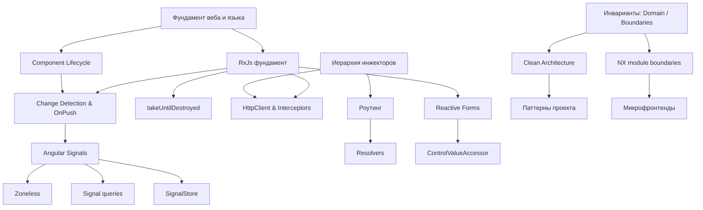

# MOC: Angular

> Карта всех заметок по Angular и фронтенд-архитектуре: от фундамента языка до применения в Gerer Construire.

## Overview

25 атомарных заметок (июнь–сентябрь 2026) + проектные заметки Gerer Construire. Раньше они были связаны только попарно; эта карта задаёт порядок чтения и показывает, где заметок пока нет.

## Core Concepts

### Foundations
[Без этого остальное не читается]

- [[Фундамент веба и языка]] - JS runtime, Event Loop, TS, CRP
- [[RxJs фундамент]] - Observable, Subject, flattening-операторы, catchError
- [[Иерархия инжекторов и inject() в Angular]] - DI: EnvironmentInjector / ElementInjector, injection context
- [[Angular Component Lifecycle]] - хуки от constructor до ngOnDestroy

### Reactivity & Change Detection
[Как Angular узнаёт, что нужно перерисовать]

- [[Change Detection & OnPush Strategy in Angular]] - Default vs OnPush, иммутабельность как условие
- [[Angular Signals]] - signal / computed / effect
- [[Zoneless Change Detection (Angular)]] - без Zone.js, только сигналы
- [[Signal-based queries (viewChild, contentChild)]] - DOM-запросы как сигналы
- [[RxJS Operators & takeUntilDestroyed]] - жизнь подписки = жизнь компонента
- [[NgRx SignalStore (Angular)]] - состояние поверх сигналов

### Templates & UI
- [[Директивы и Пайпы в Angular (Directives & Custom Pipes)]]
- [[Нативный control flow]] - @if / @for / @switch
- [[Content Projection и Кастомные Структурные Директивы в Angular]] - ng-content, TemplateRef, ViewContainerRef
- [[Angular. CDK Overlay, a11y-хелперы, Drag&Drop]]
- [[Современные анимации в Angular]] - вместо @angular/animations
- [[Angular i18n и локализация]]

### Forms
- [[Reactive Forms в Angular]]
- [[ControlValueAccessor в Angular]] - кастомный компонент как поле формы

### Data & Navigation
- [[Angular HttpClient & Interceptors]]
- [[Роутинг - lazy loading, guards, resolvers]]
- [[Angular Resolvers]]

### Architecture & Delivery
- [[Инварианты и приколы]] - Invariants, State Transitions, Domain Logic, Architecture Boundaries
- [[Clean Architecture for Angular Applications]] - статья-источник
- [[NX workspace module boundaries]] - границы как lint-правило
- [[Микрофронтенды, Module Federation — общее понимание]]
- [[Angular Environments & Configuration]]
- [[Angular SSR и современная гидратация]]

## Structure

### The Big Picture



## Development Paths

### Механика (theory → mechanism → implementation)
1. [[Фундамент веба и языка]]
2. [[RxJs фундамент]]
3. [[Angular Component Lifecycle]]
4. [[Change Detection & OnPush Strategy in Angular]]
5. [[Angular Signals]] → [[Zoneless Change Detection (Angular)]]
6. [[RxJS Operators & takeUntilDestroyed]]

### Данные и навигация
1. [[Иерархия инжекторов и inject() в Angular]]
2. [[Angular HttpClient & Interceptors]]
3. [[Роутинг - lazy loading, guards, resolvers]] → [[Angular Resolvers]]

### Архитектура (концепт → паттерн → код)
1. [[Инварианты и приколы]]
2. [[Clean Architecture for Angular Applications]]
3. [[Паттерны проекта]] - как это реализовано в Gerer
4. [[NX workspace module boundaries]]
5. [[Микрофронтенды, Module Federation — общее понимание]]

## Cross-Domain Connections

### Related MOCs
- [[MOC - Learning Systems]] - [[Алгоритм выполнения задачи. New Senior mindset]] назван там «learning system applied to professional work»
- [[MOC OF JS]] / [[MOC OF WEB PROGRAMMING]] - legacy-карты по ванильному JS и браузеру

### Projects
- [[Gerer Construire]] - [[Особенности Структуры]], [[Паттерны проекта]], [[Potential Scaling Challenges]], [[Общий разбор папки libs]], [[чек ап список]]
- [[Unique Learner]] - планируется FSD-рефактор по образцу Gerer

### External Connections
- [[Analytical Thinking]] ↔ [[Алгоритм выполнения задачи. New Senior mindset]] Этап 1 «Разведка»
- [[Системное мышление по Медоуз]] ↔ Zoneless / Signals: точечная реакция вместо глобального обхода дерева
- [[2026-03-21]] - список «что учить под капотом» (call stack, GC, протоколы на проводе) — слой ниже [[Фундамент веба и языка]]

## Knowledge Gaps
[На эти заметки уже ссылаются, но их нет]

- Zone.js (Signals, Zoneless, Change Detection)
- Immutability in JS (Change Detection, Директивы и Пайпы, SignalStore)
- Web Performance (4 разных названия в SSR, Анимации, Нативный control flow, Фундамент веба)
- «Где живёт состояние»: BehaviorSubject в сервисе vs Signals vs SignalStore — вопрос из Этапа 2 Senior mindset
- Feature-Sliced Design (Zoneless, Иерархия инжекторов, Unique Learner)

## Active Questions
[Собраны из секций Questions самих заметок]

- Как `ChangeDetectorRef.detectChanges()` ведёт себя в Zoneless vs `markForCheck()`? (Change Detection, Lifecycle)
- Как тестировать RxJS-потоки через TestScheduler / marble testing? (RxJs фундамент)
- Как шарить global state между Host и Remote в Module Federation? (Микрофронтенды)
- В какой момент количество архитектурных границ становится овер-инжинирингом? (Инварианты)

## Map Statistics
```dataview
TABLE
  type,
  status,
  length(file.inlinks) as "Backlinks"
WHERE contains(file.outlinks, this.file.link)
SORT status DESC, file.name ASC
```

---

**Map Health**:
- Total notes in map: 25 atomic + 6 project + 1 resource
- Evergreen notes: 0
- Seedling notes: 25
- Coverage: 0% (evergreen/total)
- Last reviewed: 2026-09-18
