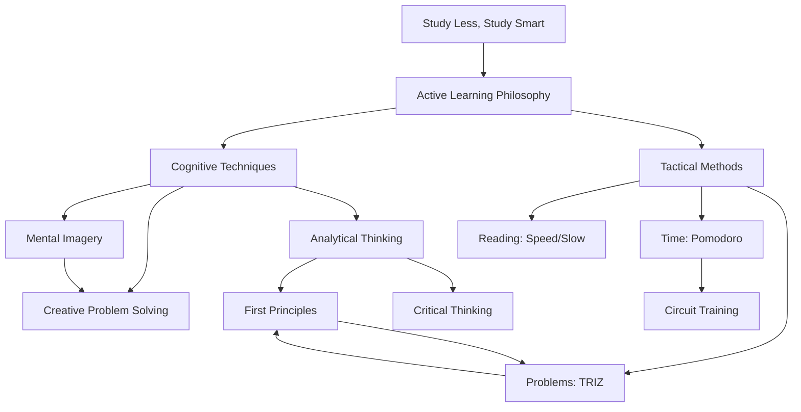

# MOC: Learning Systems

> A comprehensive map of evidence-based learning techniques, cognitive tools, and productivity methods for accelerated skill acquisition.

## Overview

This map connects the science of learning with practical techniques you can apply immediately. The goal is to transform learning from passive consumption (reading, highlighting, hoping) to active construction of understanding.

**Core insight:** Effective learning isn't about time spent—it's about engagement quality. The techniques here are battle-tested methods that optimize for understanding, retention, and application rather than mere exposure.

**Who this serves:** Anyone learning technical skills, building knowledge systems, or developing expertise in complex domains. Particularly relevant for self-directed polymaths who need efficient learning systems across multiple fields.

## Core Concepts

### Foundations
[Essential building blocks - must understand these first]

- [[Study Less Study Smart]] - 12 evidence-based principles (START HERE)
- [[Analytical Thinking]] - The meta-skill underlying all learning
- [[First Principles Thinking]] - How to understand deeply vs. memorize superficially

### Cognitive Techniques
[How your brain actually learns]

- [[Mental Imagery]] - Visualization for understanding abstraction
- [[Creative Problem Solving]] - Insight, convergent, divergent modes
- [[Critical Thinking]] - Evaluating arguments and building reasoning

### Tactical Methods
[Specific practices and protocols]

#### Time Management
- [[Pomodoro Technique]] - 25/5 focused intervals
- [[Circuit Training for Homework]] - Study + exercise intervals

#### Reading Strategies
- [[Speed Reading]] - Efficient information processing
- [[Slow Reading]] - Deep comprehension when needed

#### Problem-Solving Frameworks
- [[TRIZ Method]] - 6 systematic creativity techniques
- [[First Principles Thinking]] - Break down to rebuild better

## Structure

### The Big Picture



**Key insight from structure:**
- Analytical + Creative thinking = Complete problem-solving toolkit
- Time management enables technique application
- All roads lead back to active learning

## Development Paths

### Beginner
[Start here if new to learning systems]

1. [[Study Less Study Smart]] - Read completely, pick 3 principles to implement
2. [[Pomodoro Technique]] - Start with time management (easiest entry point)
3. [[Analytical Thinking]] - Practice on one concept daily
4. **Milestone:** Can study 2 hours focused vs. 4 hours distracted

### Intermediate
[For those with foundation]

1. [[Mental Imagery]] - Add visualization to your learning
2. [[First Principles Thinking]] - Apply to current learning domain
3. [[Circuit Training for Homework]] - Level up stamina
4. [[Speed Reading]] - Increase information throughput
5. **Milestone:** Learning new framework takes days, not weeks

### Advanced
[Deep dives and edge cases]

1. [[Creative Problem Solving]] - Deliberately practice all 3 modes
2. [[TRIZ Method]] - Systematic innovation for complex problems
3. [[Critical Thinking]] - Evaluate all learning sources critically
4. **Meta-level:** Design your own learning system for specific domains
5. **Milestone:** Can learn anything given sufficient motivation

## Cross-Domain Connections

### Related MOCs
- [[MOC: Psychology of Creation]] - Addresses blocks, perfectionism, talent anxiety
- [[MOC: Polymath Architecture]] - How to learn multiple things sustainably
- [[MOC: Productivity Systems]] - Time management and execution

### External Connections
- [[Senior Mindset Algorithm]] - Learning system applied to professional work
- [[Unique Learner]] - Teaching creates pressure-test for your learning understanding
- [[Gap-Разрыв]] - Learning systems help close aspiration-reality gap

### Unexpected Synergies
- [[Stoic Self-Discipline]] + [[Pomodoro Technique]] = Sustainable focus practice
- [[Mental Imagery]] + [[TRIZ Method]] = Enhanced creative problem-solving
- [[Circuit Training]] + [[Study Less Smart]] = Principles 1, 3, 4 combined

## Active Questions

[What's still being explored?]

- [[Q: Which learning principle gives highest ROI for technical skills?]]
- [[Q: How to build learning system for creative skills (music, film)?]]
- [[Q: Can learning techniques be TOO systematic (killing curiosity)?]]
- [[Q: How to adapt these for ADHD/neurodivergent learners?]]

## Application Tracking

### Weekly Learning Protocol
Based on this MOC's techniques:

**Monday:**
- Review last week's learnings (Study principle 9)
- Set 3 learning goals for week
- Identify which technique fits each goal

**Daily:**
- 2-3 Pomodoro sessions (or Circuit Training if energy low)
- Active recall before bed (What did I learn today?)
- One concept visualized via Mental Imagery

**Friday:**
- Teach one thing learned this week (Principle 10)
- Update this MOC with new connections

### Personal Learning Experiments

Track which techniques actually work for YOU:

| Technique | Tried? | Works for me? | Best use case |
|---|---|---|---|
| Pomodoro | ✓ | ? | When to use? |
| Circuit Training | ✗ | ? | Test next week |
| Speed Reading | ? | ? | ? |
| TRIZ | ? | ? | ? |

## Resources

### Books
- [[Суперобучение]] - Source for Pomodoro and principles
- [[How to Take Smart Notes]] - Zettelkasten method
- [[Building a Second Brain]] - PARA organization

### Projects
- [[Unique Learner]] - Teaching platform implementing these principles
- [[Gerer Construire]] - Professional application of learning
- [[Senior Mindset Algorithm]] - Learning applied to software development

### External
- [Study Less, Study Smart - YouTube](https://www.youtube.com/watch?v=IlU-zDU6aQ0)
- Ali Abdaal productivity research
- Colin Galen problem-solving content

## Map Statistics
```dataview
TABLE
  type,
  status,
  length(file.inlinks) as "Backlinks"
WHERE contains(file.outlinks, this.file.link)
SORT status DESC, file.name ASC
```

---

**Map Health**:
- Total notes in map: 10 core + 5 supporting
- Evergreen notes: 1 (Study Less Study Smart)
- Budding notes: 9
- Seedling notes: 5
- Coverage: 65% (need more application examples)
- Last reviewed: 2026-03-22

**Next steps for this MOC:**
1. Add "How I actually used X" notes for each technique
2. Create learning templates per domain (code, creative, physical)
3. Connect to daily/weekly review routines
4. Add case studies: "How I learned Angular in 2 weeks using this system"
