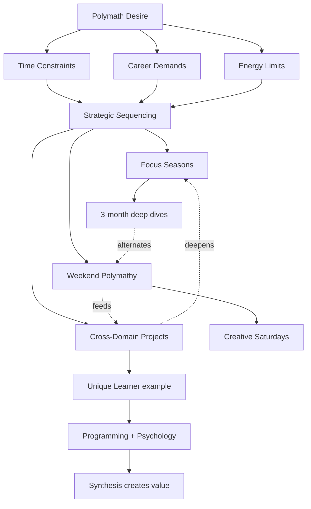

# MOC: Polymath Architecture

> A system for sustainable polymathy: How to cultivate multiple interests and skills without burning out, becoming a dilettante, or sacrificing career depth.

## Overview

**The polymath's dilemma:** You want to be a Renaissance person (filmmaker, pilot, musician, programmer, multilinguist) but the modern world demands specialization for career success. How do you honor your curiosity without fragmenting your potential?

**Your specific version:**
- Career requires: Angular expert, senior developer
- Soul requires: Film, music, mountains, languages, travel
- Fear: Becoming "jack of all trades, master of none"
- Current state: Paralyzed between focus and exploration

**This MOC's purpose:** Design a life architecture that supports BOTH depth and breadth sustainably. Not compromise—*integration*.

**Key insight:** Polymathy isn't about equal time to all interests. It's about strategic sequencing, cross-domain synthesis, and leveraging your unique intersection.

## Core Concepts

### Foundations
[Mental models for sustainable polymathy]

- [[Modern Polymath]] - Definition, characteristics, benefits
- [[T-Shaped Skills]] - Depth in one area, breadth across many
- [[Life of Ultimate Focus]] - The seemingly contradictory pole
- [[Stoic Self-Discipline]] - Managing desire and expectation

### The Tension
[Contradictions to resolve]

**Depth vs Breadth:**
- Career pressure: "Specialize or perish"
- Inner drive: "Everything interests me"
- Time reality: 24 hours, finite energy
- Identity question: "Who am I if I'm many things?"

**Process vs Outcome:**
- You know: "Фокусируйся на процессе, отбрось результат"
- You feel: Results are the only proof of capability
- [[Stoic Self-Discipline]]: "Don't expect outcomes"
- Your ambition: Demands specific outcomes (greatness)

**Curiosity vs Mastery:**
- [[Modern Polymath]]: Follow curiosity everywhere
- [[Life of Ultimate Focus]]: Sustained attention builds mastery
- Your talent essay: "Почему я не могу просто заниматься делами потому что мне весело?"

### Skills Architecture Models

#### Model 1: T-Shaped
- One vertical: Deep expertise (employable)
- One horizontal: Broad knowledge (interesting)
- **For you:** Angular (depth) + diverse interests (breadth)

#### Model 2: π-Shaped (Pi)
- Two verticals: Two deep domains
- One horizontal: Connection between them
- **For you:** Programming + Psychology = Unique Learner platform

#### Model 3: M-Shaped
- Multiple peaks: 3-4 depth domains
- **Risk:** Spreading too thin
- **Requires:** 5-10 year timeline

#### Model 4: Comb-Shaped (Preferred for you)
- One dominant spike: Career anchor
- Several smaller spikes: Developed hobbies
- **Structure:** 70% depth / 20% secondary / 10% exploration

## Structure

### The Big Picture



**Strategic principles:**
1. **Sequencing over parallelization** - Focus seasons, not simultaneous pursuits
2. **Integration over isolation** - Find overlaps (programming + music = generative art)
3. **Evidence over identity** - "I'm learning piano" vs. "I'm a musician"
4. **Contribution over collection** - Create outputs, not just consume inputs

## Development Paths

### Beginner: The Dabbler (Current Risk)
[Symptoms: Many interests, little depth, frustrated]

**Trap:** Starts 10 things, finishes none. Feels like jack-of-all-trades.

**Prescription:**
1. **Choose ONE anchor domain** - This is your depth spike (likely: Angular/Web Dev)
2. **Commit 6-12 months** - Deep dive until you feel competent
3. **Allow ONE hobby** - Weekend pursuit only (choose: film, music, or language)
4. **Evidence building:** Track: "I can do X now that I couldn't 3 months ago"

**Milestone:** One domain where you feel confident answering advanced questions

### Intermediate: The Specialist with Hobbies
[Depth established, breadth emerging]

**Structure:**
- **Weekday (70%):** Depth domain (professional work)
- **Saturday AM (20%):** Secondary skill development
- **Sunday PM (10%):** Exploration/new curiosity

**Schedule example:**
- **Q1 2026:** Angular mastery + Film fundamentals
- **Q2 2026:** Angular mastery + Music production
- **Q3 2026:** Angular mastery + Spanish
- **Q4 2026:** Angular mastery + Return to film (leveled up)

**Key:** Secondary skills rotate but depth domain is constant anchor.

**Milestone:** Two domains at "conversational competence," one at "professional level"

### Advanced: The Synthesist
[Creating value from unique intersections]

**Characteristics:**
- Deep expertise in 1-2 domains
- Competence in 3-5 secondary domains
- Actively finding cross-pollination

**Examples:**
- Programming + Psychology = Adaptive learning platforms
- Code + Music = Generative audio tools
- Film + Programming = Interactive storytelling
- Design + Philosophy = Meaningful product experiences

**Projects emerge from intersections:**
- [[Unique Learner]] - Programming + Learning Science + Psychology
- Potential: Music app for ADHD using your learning principles
- Potential: Documentary about polymaths using your research

**Milestone:** Your unique intersection is your professional differentiator

## Cross-Domain Connections

### Related MOCs
- [[MOC: Learning Systems]] - HOW to learn new domains efficiently
- [[MOC: Psychology of Creation]] - Resolving blocks that prevent exploration
- [[MOC: Productivity Systems]] - Time management for multiple pursuits

### Bucket List Integration
Your desires from `Bucket list.md`:
- Filmmaking
- Piloting
- Music production
- Mountaineering
- Languages (Spanish)
- European travel

**Architecture:**
Don't do all simultaneously. **Sequence them:**
- **Years 1-2:** Programming depth + Film (weekends)
- **Years 3-4:** Programming depth + Music + Piloting (alternating quarters)
- **Years 5+:** Programming depth + Travel/Language immersion + Mountain training

**Key:** Depth domain funds the breadth pursuits (career stability enables exploration).

### Career Pragmatism
Your professional notes show senior-level thinking emerging:
- [[Senior Mindset Algorithm]] - Разведка → Проектирование → Реализация → Паранойя
- [[NX workspace module boundaries]] - Deep architectural knowledge
- [[Gerer Construire]] - Complex project application

**Reality:** This depth took years. It's your anchor. Protect it while exploring.

### The Focus Paradox

[[Life of Ultimate Focus]] seems to contradict [[Modern Polymath]], but actually:

**Ultimate focus = Choosing what to focus on RIGHT NOW**

Not "focus on one thing forever" but "focus on one thing per session."

**Resolution:**
- Pomodoro 1-4: Angular feature (ultimate focus)
- Pomodoro 5-6: Film editing tutorial (ultimate focus)
- Different objects, same quality of attention

## Active Questions

**Strategic Questions:**
- [[Q: How many domains can one person develop seriously in a lifetime?]]
- [[Q: When does breadth become distraction vs. enrichment?]]
- [[Q: What's my unique intersection (adjacency advantage)?]]

**Tactical Questions:**
- [[Q: How to design weekly schedule for depth + breadth?]]
- [[Q: Can weekend hobbies ever become professional?]]
- [[Q: How to prevent secondary skills from degrading?]]

**Identity Questions:**
- [[Q: Am I allowed to call myself X if I'm not "that good yet"?]]
- [[Q: Is polymathy a personality trait or a choice?]]
- [[Q: What if my anchor domain bores me eventually?]]

## Practical Systems

### Weekly Schedule Template

**Sustainable Polymath Week:**

**Monday-Friday (Depth):**
- 9am-5pm: Angular/professional work
- Evening: Learning Systems study (1 pomodoro)
- Guilt-free focus on ONE domain

**Saturday AM (Secondary Skill):**
- 9am-1pm: Deep work on current secondary (Film, Music, etc.)
- Use [[Circuit Training]] pattern if energy helps
- Produce something small (scene edit, song sketch, essay)

**Sunday (Exploration + Integration):**
- Morning: New curiosity exploration (books, courses, experiments)
- Afternoon: Cross-pollination projects
- Evening: Weekly review + planning

**One evening per week:** Renaissance salon
- Read philosophy, art theory, science
- Feed the polymath hunger without project pressure

### Focus Seasons System

**3-month rotations for secondary skills:**

| Quarter | Depth (constant) | Secondary | Exploration |
|---|---|---|---|
| Q1 | Angular/Professional | Film fundamentals | Photography |
| Q2 | Angular/Professional | Music production | Audio engineering |
| Q3 | Angular/Professional | Spanish | Latin American cinema |
| Q4 | Angular/Professional | Return to Film (level 2) | Screenwriting |

**Key:** Rotation prevents boredom, returns deepen skills, exploration feeds new ideas.

### The Portfolio Method

**Instead of:**
"I want to be filmmaker, pilot, musician, programmer, polyglot"

**Try:**
"I'm building a portfolio of capabilities over 10 years"

**Years 1-2:** Programming (professional) + Film (competent)
**Years 3-4:** + Music (competent)
**Years 5-6:** + Piloting (competent)
**Years 7-8:** + Spanish (fluent)
**Years 9-10:** Synthesis projects using all domains

**By 35:** You ARE the polymath. But you got there patiently.

## Resolution: The Paradoxes

### 1. Focus vs Exploration
**Answer:** Sequential focus, not simultaneous
- Focus within sessions (Pomodoro)
- Explore across seasons (quarters)
- Different timescales, no contradiction

### 2. Depth vs Breadth
**Answer:** Comb-shaped architecture
- Depth = career survival + confidence building
- Breadth = soul nourishment + creative fuel
- Both necessary, different purposes

### 3. Process vs Outcome
**Answer:** Process IN outcome-directed activity
- Have direction (B point exists)
- Enjoy journey (A → B is the living)
- [[Stoic Self-Discipline]]: Don't attach to specific outcomes, but move in valued direction

### 4. Ambition vs Self-Compassion
**Answer:** And/Both, not Either/Or
- Ambition sets direction
- Self-compassion provides fuel
- Ambition without compassion = burnout
- Compassion without ambition = stagnation

**From your research:** "Твое любопытство — это и есть «разрешение» от самой жизни"

## Resources

### Supporting Notes
- [[Modern Polymath]] - The foundation
- [[First Principles Thinking]] - Apply to polymath design
- [[Study Less Study Smart]] - Efficient learning enables breadth
- [[Creative Problem Solving]] - Cross-domain thinking

### Living Examples
- Leonardo da Vinci - Your inspiration
- Modern: Tim Ferriss, Derek Sivers - Portfolio approach
- You: Building evidence one project at a time

### Books to Add
- [ ] David Epstein - "Range" (generalists in specialist world)
- [ ] Robert Greene - "Mastery" (depth path)
- [ ] Tim Ferriss - "4-Hour Chef" (meta-learning for polymaths)

### Your Projects as Research
- [[Unique Learner]] - Tests if programming + psychology actually synthesize
- [[Bucket List]] - Long-term polymath roadmap
- [[Essay: Talent]] - Working through permission anxiety

## Map Statistics
```dataview
TABLE
  type,
  status,
  length(file.inlinks) as "Backlinks"
WHERE contains(file.outlinks, this.file.link)
SORT status DESC, file.name ASC
```

---

**Map Health**:
- Total notes in map: 6 core + 8 supporting
- Evergreen notes: 0
- Budding notes: 4
- Seedling notes: 2
- Coverage: 50% (need schedule implementation and evidence)
- Last reviewed: 2026-03-22

**Implementation checklist:**
- [ ] Choose current secondary skill (Film, Music, or Language?)
- [ ] Design actual weekly schedule using template above
- [ ] Test one Focus Season (3 months) and evaluate
- [ ] Track: Does this architecture reduce Gap anxiety?
- [ ] Create "My Unique Intersection" note
- [ ] Evidence log: What depth + breadth actually enables

**Success metric:** You feel like a polymath-in-development, not a faker trying to be Leonardo overnight.
