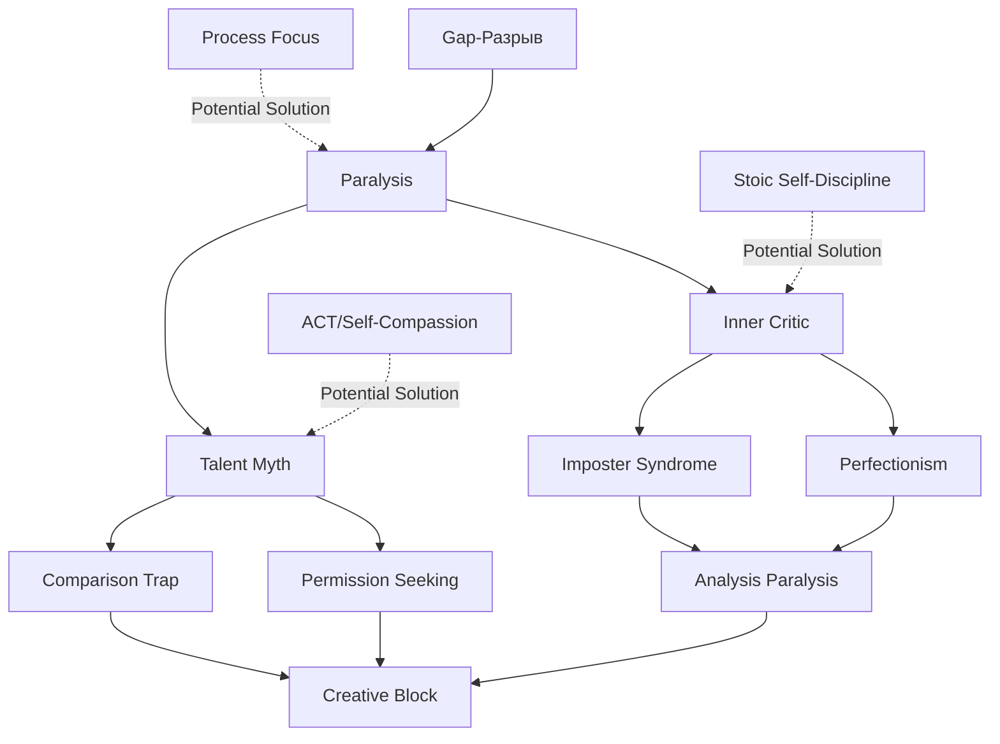

# MOC: Psychology of Creation

> Understanding and resolving the psychological blocks that prevent creation: perfectionism, talent anxiety, imposter syndrome, and the Gap between aspiration and action.

## Overview

**The Core Question:** *"Как быть великим, не ненавидя себя за то, что я ещё не там?"*
(How to be great without hating myself for not being there yet?)

This map addresses your central struggle: You have ambition, curiosity, and skill—but internal barriers prevent consistent creation. You're trapped between:
- Point A (where you are) and Point B (where you want to be)
- Your inner child's curiosity and your inner critic's judgment
- The desire to create and the belief you need "talent permission" first

**What makes this different:** Most self-help treats symptoms. This map treats the system—identifying the cognitive patterns, emotional schemas, and belief structures that create creative paralysis.

**The insight you already have:** "Талантлив ли я или нет, меня это не должно останавливать" (Whether I'm talented or not, this shouldn't stop me). You know the answer intellectually. Now we need to know it *emotionally*.

## Core Concepts

### Foundations
[The psychological mechanisms at play]

- [[Gap-Разрыв]] - The paralysis between current state and aspiration
- [[Essay: Talent]] - Your raw, honest exploration of talent anxiety
- [[Q: Как быть великим, не ненавидя себя за то, что я ещё не там]] - The central question driving this MOC
- [[Article: Преодоление внутреннего барьера]] - Perfectionism, rumination, imposter syndrome guide

### Belief Structures
[What you believe that blocks you]

**Current beliefs (from your notes):**
- "Я никогда не ощущал себя талантливым"
- "Значит мне придется работать в 2 раза усерднее чем талантливые люди"
- "Мне безумно хочется... ярлыка 'талантливый'"
- "В своих фантазиях я лузер"

**The myth:** Talent = Permission to create

**The truth you know but don't feel:**
"Мое любопытство — это и есть «разрешение» от самой жизни"

### Psychological Frameworks

#### Inner Critic Architecture
From your research list:
- **Punishing parent state** (schema therapy)
- **Vulnerable/impulsive child state**
- **Identity-oriented perfectionism**
- **Cognitive fusion** (ACT concept: thoughts = reality)

#### The Validation Trap
From your essay, line 5-6:
"Я не хочу заниматься музыкой чтобы впечатлить кого то, но я будто бы хочу быть талантлив в музыке чтобы на мне был ярлык 'талантливый'"

**Pattern:** You're not performing for others (healthy) but for an imagined tribunal judging your worthiness (unhealthy).

## Structure

### The Big Picture



**The vicious cycle:**
Gap → "I need talent to cross it" → Comparison → "I'm not talented enough" → Inner critic → Paralysis → Gap widens

**Breaking points:**
1. **At Gap:** Reframe B as direction, not judgment
2. **At Talent:** Replace permission-seeking with curiosity-following
3. **At Critic:** Cognitive defusion (thoughts aren't facts)
4. **At Paralysis:** Small actions despite discomfort

## Development Paths

### Phase 1: Understanding (2-3 weeks)
[Diagnosis before treatment]

1. **Read research books** (your list is excellent):
   - [ ] Jeffrey Young - "Reinventing Your Life" (schema therapy)
   - [ ] Steven Hayes - "A Liberated Mind" (ACT fundamentals)
   - [ ] Russ Harris - "The Happiness Trap" (ACT applied)
   - [x] Rick Rubin - "The Creative Act" (already read)

2. **Map your patterns:**
   - Daily log: "Where did inner critic appear?"
   - Identify triggers: What situations activate talent anxiety?
   - Notice schema: When do you need "permission"?

3. **Create diagnostic notes:**
   - "My Inner Critic: Patterns and Triggers"
   - "When I Feel Like an Imposter"
   - "Situations That Paralyze Me"

### Phase 2: Experimentation (4-6 weeks)
[Test interventions]

1. **ACT practices:**
   - **Cognitive defusion:** "I'm having the thought that I'm not talented enough" (vs. "I'm not talented enough")
   - **Values clarification:** Why do you ACTUALLY want to create?
   - **Committed action:** Create despite discomfort

2. **Self-compassion protocols:**
   - When critic appears: "This is a moment of suffering. Many people feel this. May I be kind to myself."
   - Replace "I'm not talented" with "I'm learning, like everyone"

3. **Small actions experiment:**
   - Choose one creative project
   - Commit to 15 min daily for 30 days
   - Track: Critic appearances vs. creative output
   - Hypothesis: Output increases as critic loses power

### Phase 3: Integration (Ongoing)
[Build sustainable creation practice]

1. **Daily rituals:**
   - Morning: "What will I create today?" (not "Am I good enough?")
   - During work: Defusion when critic appears
   - Evening: "What did I make?" (celebrate action, not perfection)

2. **Weekly review:**
   - Creative output this week (measure by action, not quality)
   - Critic battles won
   - One insight from psychology reading applied

3. **Monthly synthesis:**
   - Update answer to core question
   - Add "evidence for" your growing confidence
   - Track: Gap shrinking or relationship to it changing?

## Cross-Domain Connections

### Related MOCs
- [[MOC: Learning Systems]] - HOW to learn resolving these blocks
- [[MOC: Polymath Architecture]] - Managing breadth without overwhelm (reduces Gap anxiety)
- [[MOC: Stoic Philosophy]] - Alternative framework for handling aspiration

### Key Projects
- [[Unique Learner]] - Teaching neurodivergent learners may mirror your own struggles
- [[Essay: Talent]] - Your raw exploration (return here after research)
- [[Bucket List]] - All these ambitions activate your Gap/talent anxiety

### Philosophical Foundations
- [[Stoic Self-Discipline]] - "Don't expect" vs. "Pursue greatness" tension
- [[Интеллектуальные заметки]] - Cage, Martin, Borges on creativity from "nothing"
- [[Article: Hunger to be Everything]] - Polymathic desire as source of suffering?

### Unexpected Connections
- [[Creative Problem Solving]] - Insight mode requires STOPPING analytical criticism
- [[Circuit Training for Homework]] - Physical movement interrupts rumination
- [[Mental Imagery]] - Visualizing success vs. visualizing inadequacy

## Active Questions

**Diagnostic Questions:**
- When does my talent anxiety appear? (Triggers)
- What does my inner critic actually say? (Exact words)
- What would I do if I already believed I was "talented enough"?

**Research Questions:**
- [[Q: How does ACT work for creative blocks specifically?]]
- [[Q: Is self-compassion different from self-indulgence?]]
- [[Q: What's the relationship between perfectionism and excellence?]]

**Application Questions:**
- [[Q: How do successful creators handle self-doubt?]]
- [[Q: What's the minimum daily practice that maintains creative momentum?]]
- [[Q: Can systems thinking be applied to emotional patterns?]]

## The Answer (In Progress)

Your research and essay have brought you 85% to the answer. Here's what you've discovered:

### What You Know:
✓ Talent is not permission to act
✓ Curiosity is legitimate authorization
✓ Process > Results (results are "not loyal")
✓ Your value isn't measured by external validation
✓ The inner child's fire should lead, not the critic's judgment

### What You're Learning:
→ How to *feel* this truth when critic activates (not just know it)
→ Specific defusion techniques for talent thoughts
→ How to act while feeling inadequate (ACT core skill)
→ Distinguishing rumination (destructive) from reflection (constructive)

### What Remains:
? Daily protocol when paralysis hits
? How to maintain creation when motivation fades
? Reconciling ambition with self-compassion
? Evidence-building: Proof that you CAN create without talent label

**Next milestone:** Complete answer note with:
- Cognitive protocol (what to think)
- Behavioral protocol (what to do)
- Evidence log (proof it works)
- Emergency kit (when it fails)

## Resources

### Books
- [[Jeffrey Young - Reinventing Your Life]] - Schema therapy
- [[Steven Hayes - A Liberated Mind]] - ACT fundamentals
- [[Russ Harris - The Happiness Trap]] - ACT applied
- [[Rick Rubin - The Creative Act]] - Creator's mindset
- [[Cal Newport - So Good They Can't Ignore You]] - Skill vs. passion

### Articles
- [[Article: Преодоление внутреннего барьера]] - Perfectionism guide
- [[Article: The Hunger to Be Everything]] - Polymathic desire warning

### Projects as Therapy
- [[Unique Learner]] - Build for others what you need yourself
- [[Essay: Talent]] - Write to understand
- [[Public Learning]] - Share journey despite imperfection

### External Resources
- Steven Hayes ACT materials
- Kristin Neff self-compassion research (ADD THIS)
- BPS research on imposter syndrome

## Map Statistics
```dataview
TABLE
  type,
  status,
  length(file.inlinks) as "Backlinks"
WHERE contains(file.outlinks, this.file.link)
SORT status DESC, file.name ASC
```

---

**Map Health**:
- Total notes in map: 8 core + 12 supporting
- Evergreen notes: 0 (this is the work to do)
- Budding notes: 3
- Seedling notes: 5
- Coverage: 45% (need research completion and protocols)
- Last reviewed: 2026-03-22

**Critical path:**
1. Complete psychology reading list (4 books)
2. Fill Gap-Разрыв note completely
3. Answer core question definitively
4. Create daily protocol note
5. Test for 30 days
6. Update coverage to 80%+

**Success metric:** You ship creative projects regularly despite inner critic's protests.
