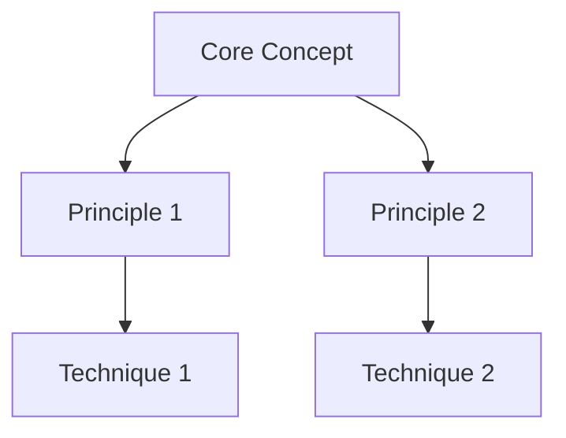

# MOC: <% tp.file.title %>

> [One-line description of what this map covers]

## Overview

[2-3 paragraphs explaining the domain and why it matters]

## Core Concepts

### Foundations
[Essential building blocks - must understand these first]

- [[]]
- [[]]

### Principles
[General truths that guide this domain]

- [[]]
- [[]]

### Techniques
[Specific methods and practices]

- [[]]
- [[]]

## Structure

### The Big Picture
[How do these concepts fit together?]


## Development Paths

### Beginner
[Start here if new to this domain]

1. [[]]
2. [[]]
3. [[]]

### Intermediate
[For those with foundation]

1. [[]]
2. [[]]

### Advanced
[Deep dives and edge cases]

1. [[]]
2. [[]]

## Cross-Domain Connections

### Related MOCs
- [[MOC: ]] - How they connect

### External Connections
- Connects to [[]] in unexpected ways
- Contradicts [[]]
- Extends [[]]

## Active Questions

[What's still being explored?]

- [[Q: ]]
- [[Q: ]]

## Resources

### Books
- [[]]

### Projects
- [[]]

### External
- [Link]()

## Map Statistics
```dataview
TABLE 
  type,
  status,
  length(file.inlinks) as "Backlinks"
WHERE contains(file.outlinks, this.file.link)
SORT status DESC, file.name ASC
```

---

**Map Health**:
- Total notes in map: 
- Evergreen notes: 
- Seedling notes: 
- Coverage: % (evergreen/total)
- Last reviewed: <% tp.date.now("YYYY-MM-DD") %>